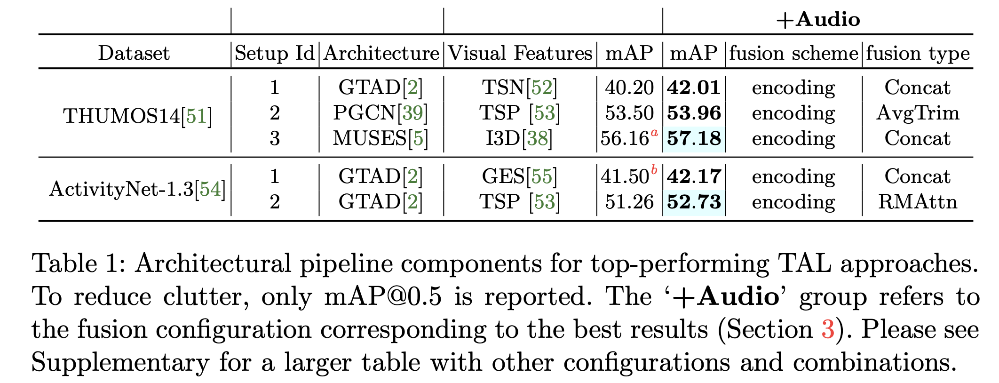

# AVfusion <span id = "top"></span>

## TAL-HMO
Fusional approaches for temporal action localization in untrimmed videos

[](https://paperswithcode.com/sota/temporal-action-localization-on-thumos14?p=hear-me-out-fusional-approaches-for-audio)

[](https://paperswithcode.com/sota/temporal-action-localization-on-activitynet?p=hear-me-out-fusional-approaches-for-audio)


This repo holds the codes and models for the  framework, introduced in the paper: 

["Hear Me Out: Fusional Approaches for AudioAugmented Temporal Action Localization"](https://arxiv.org/pdf/2106.14118v1.pdf).

# Contents
----
* [Overview](#oview)
* [Data](#data)
* [Fusion](#fuse)
* [Training and Inference](#train)
* [Best proposals](#bestprop)
* [Other info](#other)
    * [citation](#cite)
    * [contact](#contact)
----

# Overview <span id = "oview"> </span>

State  of  the  art  architectures  for  untrimmed  video  Temporal  Action  Localization (TAL)  have  only  considered  RGB  and  Flow  modalities,  leaving  the  information-rich audio  modality  totally  unexploited.   Audio  fusion  has  been  explored  for  the  related but arguably easier problem of trimmed (clip-level) action recognition.  However, TAL poses a unique set of challenges.  In this paper, we propose simple but effective fusion-based approaches for TAL. To the best of our knowledge, our work is the first to jointly consider audio and video modalities for supervised TAL. We experimentally show that our schemes consistently improve performance for state of the art video-only TAL approaches.   Specifically,  they  help  achieve  new  state  of  the  art  performance  on  large-scale benchmark datasets - **ActivityNet-1.3 (52.73 mAP@0.5)** and **THUMOS14 (57.18mAP@0.5)**. Our experiments include ablations involving multiple fusion schemes, modality combinations and TAL architectures.


# Results <span id = "results"> </span>

The following table showcases the improvement in mAP scores due to incorporation of audio in current SOTA video-only architectures.


 

[[back to top](#top)]


# Data<span id = "data"> </span>
 
 
 ## Audio features: 

 To extract the VGGish audio features use the following:

```
python extractVGGishFeatures.py --input AUDIO_FILES_PATH --output AUDIO_FEAT_PATH
```
## Video features:
 To extract the video features for THUMOS14 and ActivityNet-1.3 please refer to the documentations for the corresponding feature extractors (I3D, TSN, TSP etc.)

[[back to top](#top)]

# Fusion<span id = "fuse"> </span>

## Encoding fusion:

### Fixed<span id = "fixed"> </span>
   For the _DupTrim_, _AvgTrim_ and _Concat_ methods, the fusion can be performed in a highly modular way, detached from the video-specific architectures. The fused features can then be used to train the respective models.
   ```
   modular_fusion.py --type FUSION_TYPE --apath AUDIO_FEAT_PATH --vpath VIDEO_FEAT_PATH --fusedpath FUSED_FEAT_PATH
   ```

### Learnable<span id = "learnf"> </span>
   For _RMattn_, the fusion scheme has learnable parameters, and must therefore be trained as part of the existing video-specific architectures. To that end, we make minimal changes to the model definitions of the existing video-only methods to apply the learnable Residual Multimodal Attention fusion. The following can be easily plugged into the corresponding approaches and trained together with the video and audio features as inputs.

   GTAD
   
   ```
   GTAD_models.py
   
   ```
   Muses
   ```
   Muses_models.py
   ```
   PGCN
   ```
   pgcn_models.py
   ```
   
## Proposal fusion:<span id = "prop"> </span>

For proposal fusion the audio-only proposals and video-only proposals can be pooled together to generate a combined proposal pool which can be processed similarly to the corresponding video-only proposal post-processing approaches. This does not require any additional implementaion.


# Training and Inference<span id = "train"> </span>

In order to train and test the different video-specific architectures with the fusion schemes please refer to the documentations for the corresponding approaches ([GTAD](https://github.com/frostinassiky/gtad), [Muses](https://github.com/xlliu7/MUSES), [PGCN](https://github.com/Alvin-Zeng/PGCN)).
* For [_fixed encoding fusion_](#fixed) and [_proposal fusion_](#prop) no changes are necessary.
* For [_learnable fusion_](#learnf), just replace the model definitions with the RM attention versions provided here, and concatenate the audio inputs to the original video inputs.  


# Best proposals:  
## Proposals to replicate the best results for each dataset :
   ----
   * Best_proposals/propsAnet.zip for ActivityNetv1.3
   * Best_proposals/propsThumos.zip for Thumos14
   ----

[[back to top](#top)]


# Other info <span id = "other"> </span>

   ### citation<span id = "cite"> </span>
   ### contact<span id = "contact"> </span>
   For questions and suggestions, file an issue or contact Jazib Mahmood at "jazib.mahmood@research.iiit.ac.in".

[[back to top](#top)]   
   

