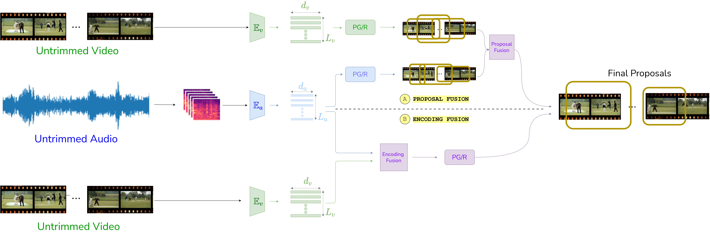
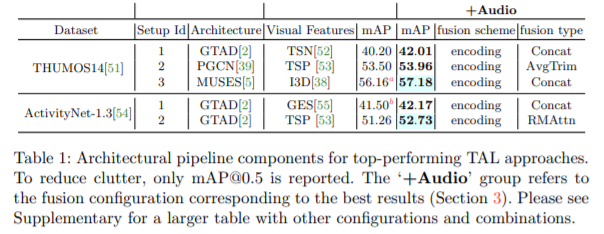

# AVfusion <span id = "top"></span>

## tal-hmo
Fusional approaches for temporal action localization in untrimmed videos

[](https://paperswithcode.com/sota/temporal-action-localization-on-thumos14?p=hear-me-out-fusional-approaches-for-audio)

[](https://paperswithcode.com/sota/temporal-action-localization-on-activitynet?p=hear-me-out-fusional-approaches-for-audio)

This repo holds the codes and models for the  framework, introduced in the paper: 

["Hear Me Out: Fusional Approaches for AudioAugmented Temporal Action Localization"](https://arxiv.org/pdf/2106.14118v1.pdf).

# Contents
----
* [Paper Introduction](#intro)
* [Prerequisites](#prerequisites)
* [Data setup](#setup)
* [Download datasets](#data)
* [Training](#train)
* [Testing](#test)
* [Other info](#other)
    * [citation](#cite)
    * [contact](#contact)
----

# Paper Introduction <span id = "intro"> </span>

State  of  the  art  architectures  for  untrimmed  video  Temporal  Action  Localization (TAL)  have  only  considered  RGB  and  Flow  modalities,  leaving  the  information-rich audio  modality  totally  unexploited.   Audio  fusion  has  been  explored  for  the  related but arguably easier problem of trimmed (clip-level) action recognition.  However, TAL poses a unique set of challenges.  In this paper, we propose simple but effective fusion-based approaches for TAL. To the best of our knowledge, our work is the first to jointly consider audio and video modalities for supervised TAL. We experimentally show that our schemes consistently improve performance for state of the art video-only TAL approaches.   Specifically,  they  help  achieve  new  state  of  the  art  performance  on  large-scale benchmark datasets - ActivityNet-1.3 (52.73 mAP@0.5) and THUMOS14 (57.18mAP@0.5). Our experiments include ablations involving multiple fusion schemes, modality combinations and TAL architectures.



# Results <span id = "results"> </span>

The following table showcases the improvement in mAP scores due to incorporation of audio in current SOTA video-only architectures.



# Prerequisites <span id = "prerequisites"> </span> 

The training and testing in AVFusion is implemented in PyTorch for the ease of use. 

- [PyTorch 1.8.1][pytorch]
                   
Other minor Python modules can be installed by running

```bash
pip install -r requirements.txt
```

 The code relies on CUDA extensions. Build them with the following command:
```
python setup.py develop
```
 

[[back to top](#top)]


# Data setup <span id = "setup"> </span>
Clone this repo with git, **please remember to use --recursive**

```bash
git clone --recursive https://github.com/skelemoa/tal-hmo
```
[[back to top](#top)]


# Download datasets<span id = "data"> </span>
 Extract video features:
 We can use pre extracted I3D features of thumos from [here](https://drive.google.com/drive/folders/1-19PgCRTTNfy2RWGErvUUlT0_3J-qEb8?usp=sharing)


 Extract audio features:

```
python extractVGGishFeatures.py
```

[[back to top](#top)]


# Encoding fusion:

```
python muses_fusion.py
```
   
# Proposal fusion:

for proposal fusion eval_detection_results.py was used, twice.

First for RGB and flow, and the result was again run with Audio features.


# Training<span id = "train"> </span>

Train your own models with the following command
```
python train_net.py  DATASET  --cfg CFG_PATH --snapshot_pref SNAPSHOT_PREF --epochs 20
```
SNAPSHOT_PREF: the path to save trained models and logs, e.g `outputs/snapshpts/thumos14_rgb/`. 

We provide a script that finishes all steps on THUMOS14, including training, testing, and two-stream fusion. Run
```
bash scripts/do_all.sh
```


[[back to top](#top)]
# Testing<span id = "test"> </span>

You can obtain the detection scores by running 

```bash
sh test.sh TRAINING_CHECKPOINT
```

Here, `TRAINING_CHECKPOINT` denotes for the trained model.
This script will report the detection performance in terms of [mean average precision][map] at different IoU thresholds.

The trained models and evaluation results are put in the "results" folder.


### THUMOS14

| mAP@0.5IoU (%)                    | RGB   | Audio  | (RGB+Audio(encoding))+Flow     |
|-----------------------------------|-------|-------|---------------|
| MUSES                        | 56.16 | 4.73 | 57.18  |


[[back to top](#top)]


# Other info <span id = "other"> </span>

   ### citation<span id = "cite"> </span>
   ### contact<span id = "contact"> </span>
   For questions and suggestions, file an issue or contact Jazib Mahmood at "jazib.mahmood@research.iiit.ac.in".

[[back to top](#top)]   
   

